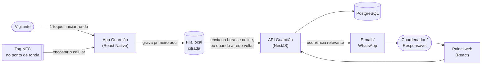
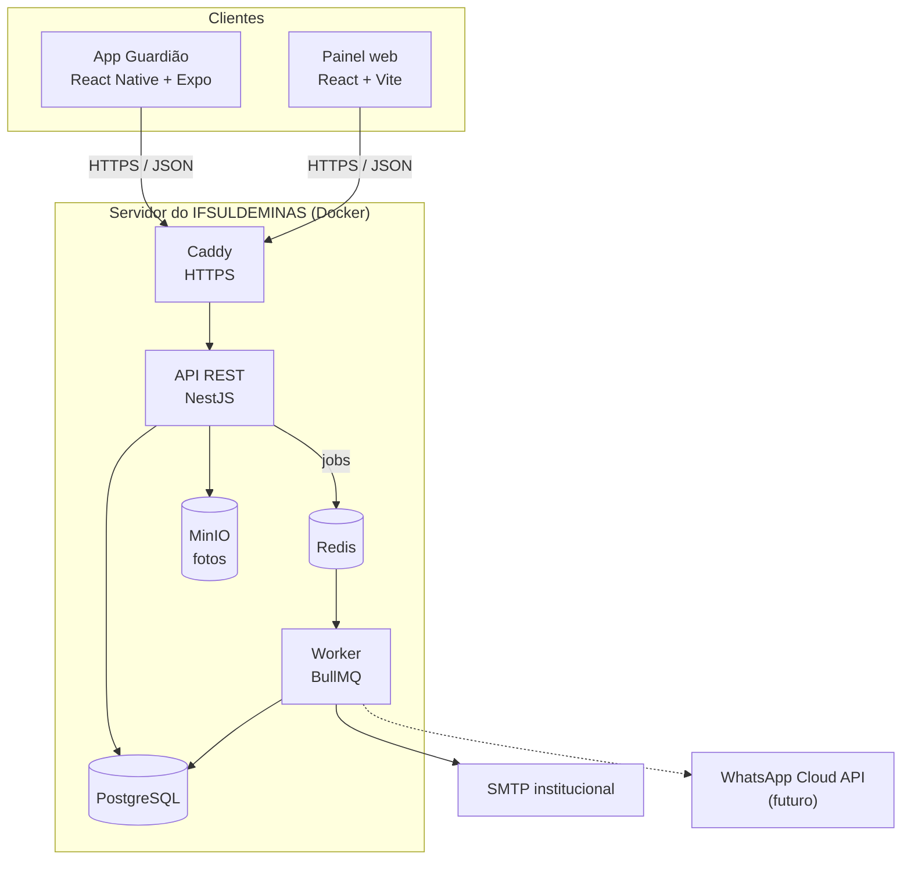
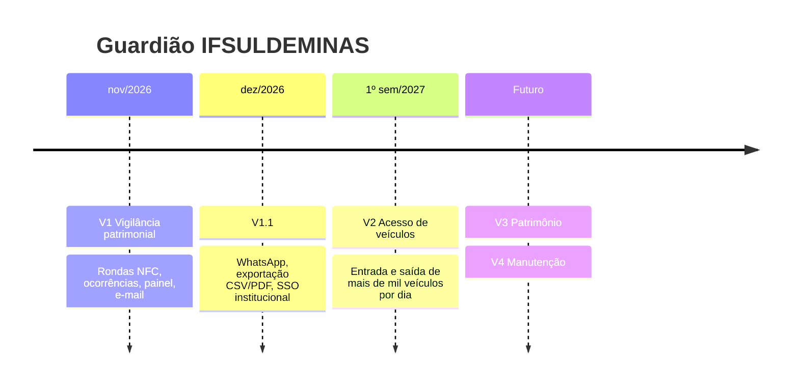

<div align="center">

# 🛡️ Guardião IFSULDEMINAS

**Rondas de vigilância patrimonial com NFC, ocorrências com fotos e painel em tempo real.**

*Codinome do projeto: **PainKiller** · Desenvolvido pela equipe **G.E.I.C.I.S***


</div>

---

## Sumário

- [Sobre](#sobre)
- [Como funciona](#como-funciona)
- [Funcionalidades da V1](#funcionalidades-da-v1)
- [Princípios](#princípios)
- [Arquitetura](#arquitetura)
- [Estrutura do repositório](#estrutura-do-repositório)
- [Começando](#começando)
- [Documentação](#documentação)
- [Processo de desenvolvimento](#processo-de-desenvolvimento)
- [Roadmap](#roadmap)
- [Equipe](#equipe)
- [Segurança](#segurança)
- [Licença](#licença)

## Sobre

O **Guardião IFSULDEMINAS** é um sistema de gestão e proteção do patrimônio público. Ele começa pelo setor de **vigilância patrimonial**: substitui os controles manuais de ronda e dá **rastreabilidade** ao que os vigilantes fazem em campo.

O vigilante usa um **app no celular** para iniciar a ronda e passa por **pontos NFC** instalados em andares e setores dos prédios. Ao encostar o celular na tag, o sistema registra o ponto, o horário, o vigilante e a localização aproximada. Assim, a instituição consegue comprovar que a ronda passou pelos locais definidos.

Se o vigilante encontrar uma irregularidade, ele abre uma **ocorrência com fotos** direto pelo app. Ela fica vinculada à ronda, ao ponto, ao horário e a quem registrou. Os **coordenadores e responsáveis** acompanham tudo num **painel web** e recebem as ocorrências relevantes por **e-mail** (e, futuramente, por WhatsApp).

Este é o **primeiro módulo** de uma plataforma maior de monitoramento dos setores do IFSULDEMINAS. Os próximos são controle de acesso de veículos (mais de mil por dia), patrimônio e manutenção.

## Como funciona



1. **Iniciar a ronda:** 1 toque na tela inicial.
2. **Passar pelos pontos:** basta encostar o celular na tag NFC. A leitura é automática e o celular vibra e mostra ✓.
3. **Encontrou um problema?** Toque em **Ocorrência**, tire a foto e envie.
4. **Sem sinal?** Tudo fica guardado **criptografado** no aparelho e é enviado sozinho quando a conexão voltar, sem duplicar nada.
5. **No painel**, o coordenador vê rondas concluídas, em andamento, atrasadas e incompletas, além das ocorrências com fotos e localização.

## Funcionalidades da V1

| Área | O que entrega | Requisitos |
|---|---|---|
| Acesso | Login individual. Depois, desbloqueio por biometria | RF01, RNF11 |
| Rondas | Rondas do turno, iniciar e finalizar com data e hora | RF02, RF03 |
| Pontos NFC | Leitura obrigatória da tag, sem marcação manual, com progresso e pendências | RF04–RF06, RF08, RF09 |
| Localização | Localização aproximada na leitura, validada contra a área do ponto | RF07 |
| Justificativas | Justificar um ponto que não pôde ser vistoriado | RF10 |
| Ocorrências | Tipo, descrição, gravidade, local e até 5 fotos | RF11–RF14 |
| Notificações | E-mail para coordenadores e responsáveis (WhatsApp quando configurado) | RF15 |
| Online-first | Envio imediato com rede. Fila cifrada e sincronização automática sem rede | RNF01–RNF07 |
| Painel | Painel do dia, histórico com filtros, detalhe da ronda com mapa | RF16, RF17 |
| Auditoria | Trilha de auditoria imutável, sem exclusões | RF18 |
| Cadastros | Prédios, andares, setores, pontos, tags NFC, responsáveis e usuários | RF19 |

Lista completa e critérios de aceitação: [docs/02-requisitos.md](docs/02-requisitos.md).

## Princípios

- **Dois toques, no máximo.** Iniciar a ronda, registrar o ponto e finalizar exigem no máximo 2 toques. Durante a ronda, a leitura NFC não precisa de nenhum. ([UX](docs/09-ux-e-design-system.md))
- **Nada se perde.** Toda ação é gravada primeiro no aparelho, cifrada, e só sai da fila quando o servidor confirma. ([Online-first](docs/06-sincronizacao-online-first.md))
- **Prova, não promessa.** O ponto só conta com leitura NFC válida, tags com assinatura dinâmica (anti-clonagem) e localização no momento da leitura. ([Segurança](docs/11-seguranca-e-lgpd.md))
- **Tudo rastreável.** Cada registro guarda quem fez, em qual aparelho, o horário do aparelho e o horário do servidor. Nada é apagado.
- **Privacidade por padrão.** A localização é coletada só nos eventos da ronda, nunca em rastreamento contínuo (LGPD).
- **Pronto para crescer.** Monólito modular: novos setores entram como novos módulos, reaproveitando o núcleo. ([Arquitetura](docs/04-arquitetura.md))

## Arquitetura



| Camada | Tecnologia |
|---|---|
| App mobile | React Native + Expo (development build), TypeScript, Expo Router, SQLite + SQLCipher (Drizzle), `react-native-nfc-manager` |
| API | Node.js LTS + NestJS (monólito modular), Prisma, zod, OpenAPI 3.1 |
| Painel web | React + Vite, TanStack Query, Tailwind CSS + shadcn/ui, Leaflet |
| Dados | PostgreSQL (schemas `nucleo` e `vigilancia`), Redis (filas), MinIO (fotos) |
| Infraestrutura | Docker Compose, Caddy, GitHub Actions, EAS Build |
| Monorepo | pnpm workspaces + Turborepo |

Detalhes, diagramas C4 e decisões: [docs/04-arquitetura.md](docs/04-arquitetura.md) e [ADRs](docs/adr/README.md).

## Estrutura do repositório

> 🚧 O código começa na Sprint 0 (história HU-001). A estrutura abaixo é a planejada.

```
PainKiller/
├── apps/
│   ├── mobile/          # App Guardião (React Native + Expo)
│   ├── api/             # API REST + worker (NestJS)
│   └── web/             # Painel do coordenador (React + Vite)
├── packages/
│   ├── shared/          # tipos, enums, schemas zod e contratos da API
│   ├── design-tokens/   # cores, tipografia e espaçamentos (mobile + web)
│   └── config/          # eslint, tsconfig e prettier compartilhados
├── infra/
│   ├── docker/          # docker-compose e Caddyfile
│   └── scripts/         # backup, restore e provisionamento de tags
├── docs/                # toda a documentação
└── .github/             # templates, CODEOWNERS e workflows
```

## Começando

> 🚧 Os comandos abaixo passam a funcionar quando a fundação do monorepo (HU-001 a HU-003) for entregue na Sprint 0.

**Pré-requisitos:** Node.js LTS (24.x), pnpm, Docker Desktop, Git, um celular Android **com NFC** (ou o leitor NFC simulado em desenvolvimento) e o app de desenvolvimento do Expo (*development build*).

```bash
git clone https://github.com/G-E-I-C-I-S/PainKiller.git
cd PainKiller
pnpm install
cp apps/api/.env.example apps/api/.env
docker compose -f infra/docker/docker-compose.dev.yml up -d   # Postgres, Redis, MinIO, Mailpit
pnpm --filter api prisma migrate dev                           # cria o banco e aplica as seeds
pnpm dev                                                       # sobe API, painel e Metro (app)
```

| Serviço | Endereço local |
|---|---|
| API | http://localhost:3000/api/v1 |
| Swagger (OpenAPI) | http://localhost:3000/api/docs |
| Painel web | http://localhost:5173 |
| Mailpit (e-mails de teste) | http://localhost:8025 |
| Console do MinIO | http://localhost:9001 |

Passo a passo completo, variáveis de ambiente e builds do app: [docs/16-implantacao-e-infraestrutura.md](docs/16-implantacao-e-infraestrutura.md) e [docs/08-app-mobile.md](docs/08-app-mobile.md).

## Documentação

| # | Documento | Conteúdo |
|---|---|---|
| — | [Índice da documentação](docs/README.md) | Por onde começar, conforme o seu papel |
| 01 | [Visão do produto](docs/01-visao-do-produto.md) | Problema, objetivos, personas, escopo e visão de plataforma |
| 02 | [Requisitos](docs/02-requisitos.md) | RF, RNF, regras de negócio, critérios de aceitação e rastreabilidade |
| 03 | [Casos de uso](docs/03-casos-de-uso.md) | Atores, diagramas e fluxos detalhados |
| 04 | [Arquitetura](docs/04-arquitetura.md) | C4, módulos, eventos, evolução e riscos técnicos |
| 05 | [Modelo de dados](docs/05-modelo-de-dados.md) | Diagramas ER, dicionário de dados e banco local |
| 06 | [Sincronização online-first](docs/06-sincronizacao-online-first.md) | Fila cifrada, idempotência e cenários de falha |
| 07 | [API](docs/07-api.md) | Endpoints, contratos, erros e permissões |
| 08 | [App mobile](docs/08-app-mobile.md) | React Native, componentização, NFC, câmera e localização |
| 09 | [UX e design system](docs/09-ux-e-design-system.md) | Regra dos 2 toques, wireframes, tokens e acessibilidade |
| 10 | [Painel web](docs/10-painel-web.md) | Telas, rotas e componentes do painel |
| 11 | [Segurança e LGPD](docs/11-seguranca-e-lgpd.md) | Ameaças, controles (MASVS/ASVS), NFC SUN e privacidade |
| 12 | [Estratégia de testes](docs/12-estrategia-de-testes.md) | Pirâmide, testes de sync, NFC, campo e usabilidade |
| 13 | [Processo Scrum](docs/13-processo-scrum.md) | Papéis, eventos, DoR, DoD e quadro |
| 14 | [Backlog e roadmap](docs/14-backlog-e-roadmap.md) | Épicos, histórias, sprints e próximos módulos |
| 15 | [Fluxo Git e contribuição](docs/15-fluxo-git-e-contribuicao.md) | Branches, commits, PRs, releases e proteções |
| 16 | [Implantação e infraestrutura](docs/16-implantacao-e-infraestrutura.md) | Ambientes, deploy, backups e instalação das tags |
| — | [ADRs](docs/adr/README.md) | Registro das decisões de arquitetura |
| — | [Glossário](docs/glossario.md) | Termos do domínio e técnicos |

## Processo de desenvolvimento

Usamos **Scrum** com **sprints de 1 semana** até a V1:

| Sprint | Período | Meta |
|---|---|---|
| Sprint 0 | 01/10 – 09/10/2026 | Fundação: monorepo, CI, ambiente, design system e modelo de dados |
| Sprint 1 | 13/10 – 16/10/2026 | Acesso e cadastros |
| Sprint 2 | 19/10 – 23/10/2026 | Planejamento e execução de ronda (NFC + localização) |
| Sprint 3 | 26/10 – 30/10/2026 | Online-first, justificativa, finalização e ocorrência |
| Sprint 4 | 03/11 – 06/11/2026 | Fotos, notificações, painel e auditoria → **Release Candidate** |
| Sprint 5 | 09/11 – 13/11/2026 | Piloto em campo e estabilização → **V1.0 em produção** |

Cada história vira uma branch `feature/HU-XXX-...` e um pull request para `develop`. **Só o mantenedor faz merge**, e o GitHub garante isso. Veja o [CONTRIBUTING.md](CONTRIBUTING.md).

## Roadmap



As datas depois da V1 são indicativas. Detalhes: [docs/14-backlog-e-roadmap.md](docs/14-backlog-e-roadmap.md).

## Equipe

Projeto desenvolvido pela equipe **G.E.I.C.I.S** para o **IFSULDEMINAS**.

| Papel | Pessoa |
|---|---|
| Mantenedor / integrador | [@madeiragab](https://github.com/madeiragab) |
| Desenvolvimento | [@Eriondoro](https://github.com/Eriondoro) e time `painkiller-dev` |
| Product Owner | a definir (sugestão: Coordenação de Vigilância) |
| Scrum Master | a definir |

## Segurança

Encontrou uma vulnerabilidade? **Não abra issue pública.** Siga a [política de segurança](SECURITY.md).

## Licença

A definir com o IFSULDEMINAS. Enquanto não houver um arquivo `LICENSE`, todos os direitos ficam reservados aos autores.
