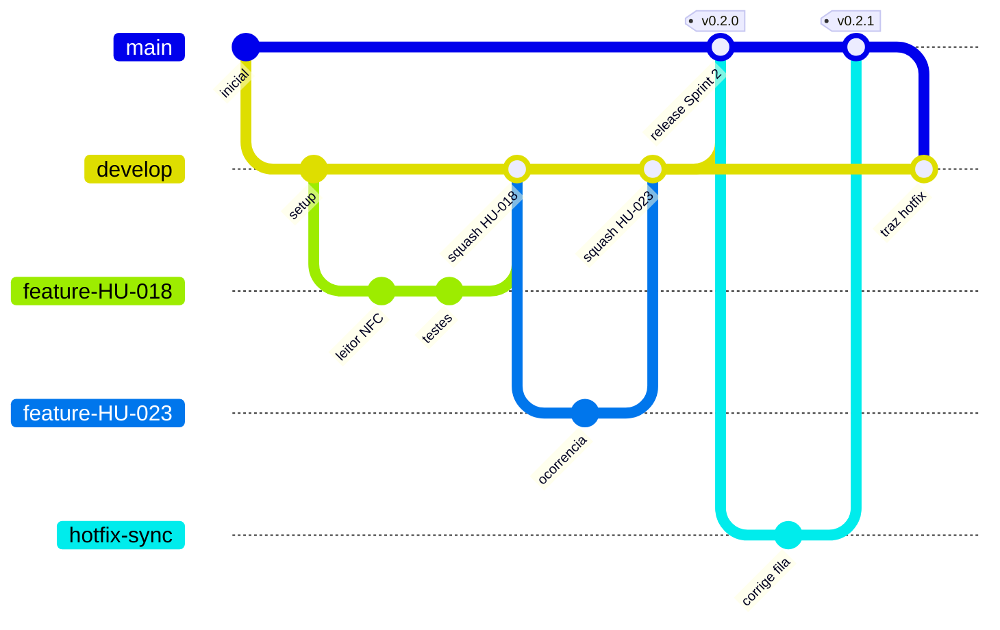

# Fluxo Git e contribuição

> Parte da [documentação do Guardião IFSULDEMINAS](README.md).

Este documento define como o time trabalha com branches, commits, pull requests, revisões e releases, e registra as proteções configuradas no repositório `G-E-I-C-I-S/PainKiller`.

**Sumário**

1. [Princípios](#1-princípios)
2. [Permissões no repositório](#2-permissões-no-repositório)
3. [Branches](#3-branches)
4. [Passo a passo de uma contribuição](#4-passo-a-passo-de-uma-contribuição)
5. [Commits](#5-commits)
6. [Pull requests e revisão](#6-pull-requests-e-revisão)
7. [Merge, releases e hotfix (mantenedor)](#7-merge-releases-e-hotfix-mantenedor)
8. [Versionamento](#8-versionamento)
9. [Proteções configuradas no GitHub](#9-proteções-configuradas-no-github)
10. [Repositório público: cuidados](#10-repositório-público-cuidados)
11. [Inicialização do repositório (uma única vez)](#11-inicialização-do-repositório-uma-única-vez)

---

## 1. Princípios

- **Ninguém faz commit direto em `main` ou `develop`.** Todo trabalho acontece numa branch própria e entra por pull request (PR).
- **Somente o mantenedor (@madeiragab) faz merge.** O GitHub garante isso tecnicamente (veja a [seção 9](#9-proteções-configuradas-no-github)).
- **Um PR = uma história (ou parte dela).** PRs pequenos são revisados mais rápido e quebram menos coisas.
- **A branch `develop` sempre funciona.** O incremento da sprint é demonstrado a partir dela na Sprint Review.
- **A branch `main` é o que está (ou vai para) produção.** Cada versão publicada recebe uma tag.

## 2. Permissões no repositório

| Quem | Papel no repositório | Pode | Não pode |
|---|---|---|---|
| @madeiragab | **Admin** (mantenedor/integrador) | Tudo: mesclar PRs em `develop` e `main`, criar tags e releases, alterar configurações | — |
| Time `painkiller-dev` (ex.: @Eriondoro) | **Write** | Criar branches, fazer push nas próprias branches, abrir e revisar PRs, gerenciar issues e o quadro | Fazer push ou mesclar em `main`/`develop`, apagar essas branches, forçar push nelas |
| Demais membros da organização | Read (padrão da organização) | Ler o código e abrir issues | Fazer push |
| Público (repositório público) | — | Ler o código e abrir issues | Fazer push (só por fork + PR, que o mantenedor avalia) |

Para entrar no time de desenvolvimento, peça ao mantenedor que adicione o seu usuário ao time `painkiller-dev` da organização G.E.I.C.I.S.

## 3. Branches



| Branch | Sai de | Volta para | Para quê | Exemplo |
|---|---|---|---|---|
| `main` | — | — | Código de produção. Cada merge corresponde a uma versão com tag | — |
| `develop` | `main` | `main` (no fim da sprint) | Integração da sprint em andamento | — |
| `feature/HU-XXX-descricao` | `develop` | `develop` | Nova funcionalidade de uma história | `feature/HU-018-leitura-nfc` |
| `fix/HU-XXX-descricao` | `develop` | `develop` | Correção de bug ainda não lançado | `fix/HU-030-backoff-duplicado` |
| `docs/descricao` | `develop` | `develop` | Somente documentação | `docs/atualiza-modelo-de-dados` |
| `chore/descricao` | `develop` | `develop` | Configuração, dependências, CI | `chore/atualiza-expo-sdk` |
| `hotfix/descricao` | `main` | `main` e depois `develop` | Correção urgente em produção | `hotfix/fila-travada-android` |

Regras de nome: letras minúsculas, palavras separadas por hífen, sem acentos e sem espaços. Sempre com o ID da história quando houver um.

## 4. Passo a passo de uma contribuição

```bash
# 1. Atualize a develop
git switch develop
git pull

# 2. Crie a branch da história
git switch -c feature/HU-018-leitura-nfc

# 3. Trabalhe e faça commits pequenos (veja a seção 5)
git add .
git commit -m "feat(mobile): leitura automática de tag NFC durante a ronda (HU-018)"

# 4. Mantenha a branch atualizada com a develop
git fetch origin
git rebase origin/develop        # ou: git merge origin/develop

# 5. Envie a branch
git push -u origin feature/HU-018-leitura-nfc

# 6. Abra o PR para a develop (ou pela interface do GitHub)
gh pr create --base develop --fill
```

Depois disso:

1. Preencha o template do PR (o que faz, como testar, evidências e checklist).
2. Mova o card da história para **Em revisão** no quadro.
3. Responda aos comentários com novos commits na mesma branch. Não abra outro PR.
4. O mantenedor revisa, aprova e faz o merge. A branch é **apagada automaticamente** depois do merge.
5. Atualize a sua `develop` local: `git switch develop && git pull`.

## 5. Commits

Usamos o padrão [Conventional Commits](https://www.conventionalcommits.org/pt-br/v1.0.0/) com mensagens **em português**, no imperativo ou no presente, curtas (até 72 caracteres na primeira linha).

```
<tipo>(<escopo>): <descrição> (HU-XXX)
```

| Tipo | Quando usar |
|---|---|
| `feat` | Nova funcionalidade |
| `fix` | Correção de bug |
| `docs` | Somente documentação |
| `refactor` | Mudança de código sem mudar comportamento |
| `test` | Adição ou ajuste de testes |
| `style` | Formatação (sem mudança de lógica) |
| `perf` | Melhoria de desempenho |
| `build` | Dependências, empacotamento, EAS |
| `ci` | Pipeline do GitHub Actions |
| `chore` | Outras tarefas de manutenção |

Escopos: `mobile`, `api`, `web`, `shared`, `design-tokens`, `infra`, `docs`, `ci`.

Exemplos:

```
feat(mobile): leitura automática de tag NFC durante a ronda (HU-018)
fix(api): rejeita evento PONTO_VISITADO de tag inativa (HU-018)
feat(api): endpoint de lote de eventos de sincronização (HU-030)
test(mobile): cobre reenvio da fila após reinício do app (HU-029)
docs: detalha política de retenção de fotos
ci: adiciona typecheck ao pipeline (HU-002)
```

Use `!` ou o rodapé `BREAKING CHANGE:` quando a mudança quebrar o contrato da API ou o formato do banco local:

```
feat(api)!: renomeia campo lidoEm para lidoEmDispositivo

BREAKING CHANGE: apps com versão anterior a 0.4.0 precisam ser atualizados.
```

## 6. Pull requests e revisão

**Quem abre o PR:**

- Título no padrão Conventional Commits, porque ele vira a mensagem do commit no squash.
- Template preenchido, com `Closes #<issue>` para fechar a issue automaticamente.
- Evidências (print, GIF ou vídeo) para qualquer mudança de interface.
- PRs com até ~400 linhas alteradas, sem contar lockfile e arquivos gerados. Se passar disso, divida.
- Use **Draft PR** para pedir opinião antes de terminar.

**Quem revisa (qualquer membro do time pode comentar; a aprovação que conta é a do mantenedor):**

- [ ] Atende aos critérios de aceitação da história?
- [ ] Respeita a arquitetura e a componentização ([04](04-arquitetura.md), [08](08-app-mobile.md))? Componentes sem regra de negócio, telas sem lógica?
- [ ] Tem testes para regras de negócio e casos de erro?
- [ ] Mantém a **regra dos 2 toques** nas telas do vigilante ([09](09-ux-e-design-system.md))?
- [ ] Segurança: nada de segredo no código, dado sensível em log, `DELETE` físico ou permissão checada só no app ([11](11-seguranca-e-lgpd.md))?
- [ ] Funciona offline quando deveria ([06](06-sincronizacao-online-first.md))?
- [ ] A documentação foi atualizada, se necessário?

**Prazo combinado:** primeira revisão em até 1 dia útil. Comentários são sobre o código, nunca sobre a pessoa. Prefira perguntas ("o que acontece se a tag estiver inativa?") a ordens.

## 7. Merge, releases e hotfix (mantenedor)

| Origem → destino | Método de merge | Motivo |
|---|---|---|
| `feature/*`, `fix/*`, `docs/*`, `chore/*` → `develop` | **Squash and merge** | Um commit limpo por história na `develop` |
| `develop` → `main` (release) | **Create a merge commit** | Preserva o histórico e evita divergência entre as branches |
| `hotfix/*` → `main` | **Create a merge commit** | Idem |
| `main` → `develop` (trazer hotfix de volta) | **Create a merge commit** | Mantém `develop` contendo tudo o que está em `main` |

Os métodos permitidos em cada branch estão travados no GitHub (seção 9).

**Release ao fim da sprint (depois da Sprint Review):**

```bash
# PR de release
gh pr create --base main --head develop --title "release: Sprint 2 (v0.2.0)"
# Depois do merge (merge commit), crie a tag e a release
git switch main && git pull
git tag -a v0.2.0 -m "Sprint 2 — planejamento e execução de ronda"
git push origin v0.2.0
gh release create v0.2.0 --generate-notes
```

Atualize o [CHANGELOG](../CHANGELOG.md) no PR de release.

**Hotfix:**

```bash
git switch main && git pull
git switch -c hotfix/fila-travada-android
# ...correção + teste...
git push -u origin hotfix/fila-travada-android
gh pr create --base main
# Depois do merge em main: tag de patch (ex.: v1.0.1) e PR main -> develop
gh pr create --base develop --head main --title "chore: traz hotfix v1.0.1 para develop"
```

## 8. Versionamento

- [SemVer](https://semver.org/lang/pt-BR/): `MAJOR.MINOR.PATCH`.
- Até a V1: `0.<sprint>.<patch>` (ex.: `v0.2.0` no fim da Sprint 2). Release Candidate: `v1.0.0-rc.1` (06/11/2026). Produção: `v1.0.0` (13/11/2026).
- O app mobile segue a mesma versão (`version` no `app.config.ts`). O `versionCode` do Android é incrementado automaticamente pelo EAS a cada build.
- A API expõe a versão em `GET /api/v1/saude`. O app envia a sua versão no login (`dispositivo.versaoApp`).

## 9. Proteções configuradas no GitHub

Configuração aplicada em 01/10/2026 no repositório `G-E-I-C-I-S/PainKiller`:

**Repositório**

| Configuração | Valor |
|---|---|
| Visibilidade | Público (necessário para usar rulesets no plano Free da organização) |
| Métodos de merge habilitados | Squash e merge commit (rebase desabilitado) |
| Apagar a branch automaticamente após o merge | Sim |
| Sugerir atualização da branch do PR | Sim |
| Auto-merge | Desabilitado |
| Wiki | Desabilitada (a documentação vive em `docs/`) |
| Issues e Projects | Habilitados |

**Rulesets** (Settings → Rules → Rulesets)

| Regra | `main` | `develop` |
|---|---|---|
| Impedir exclusão da branch | ✓ | ✓ |
| Impedir force push | ✓ | ✓ |
| Restringir atualizações (só quem tem *bypass* pode fazer push ou merge) | ✓ | ✓ |
| Exigir pull request | ✓ | ✓ |
| Aprovações necessárias | 1 | 1 |
| Exigir revisão do code owner (`.github/CODEOWNERS` → @madeiragab) | ✓ | ✓ |
| Descartar aprovações quando chegam novos commits | ✓ | ✓ |
| Exigir que todas as conversas estejam resolvidas | ✓ | ✓ |
| Métodos de merge permitidos | merge commit | squash, merge commit |
| Quem pode ignorar (*bypass*) | Papel **Admin** do repositório (somente @madeiragab) | Idem |

Na prática: membros com **Write** criam branches e abrem PRs, mas o GitHub recusa qualquer push ou merge deles em `main`/`develop`. Só o admin consegue mesclar. Como o mantenedor tem *bypass*, ele também pode mesclar os próprios PRs, mas a regra do time é sempre passar por PR.

**Segurança**

| Recurso | Estado |
|---|---|
| Secret scanning | Ativo |
| Push protection (bloqueia push com segredo detectado) | Ativo |
| Dependabot alerts | Ativo |
| Dependabot security updates | Ativo |
| Private vulnerability reporting | Ativo (veja o [SECURITY.md](../SECURITY.md)) |

**Pendências para quando o código existir**

- [ ] Depois da HU-002 (CI): adicionar a regra **Require status checks to pass** nos dois rulesets, com os jobs `lint`, `typecheck`, `test` e `build`.
- [ ] Adicionar `.github/dependabot.yml` (ecossistemas `npm` e `github-actions`) quando o `package.json` da raiz existir.
- [ ] Habilitar **CodeQL** (code scanning, gratuito em repositório público) para JavaScript/TypeScript.

## 10. Repositório público: cuidados

O repositório é público, então **todo o histórico de commits é visível para qualquer pessoa**.

- **Nunca** faça commit de `.env`, chaves, senhas, tokens, `google-services.json`, keystores ou chaves das tags NFC. O `.gitignore` já bloqueia os casos comuns, e o push protection bloqueia segredos conhecidos, mas a responsabilidade é de quem faz o commit.
- Use sempre os arquivos `*.env.example` com valores fictícios.
- **Se um segredo vazar:** considere-o comprometido. Revogue e gere um novo **imediatamente** e avise o mantenedor. Apagar o commit não basta, porque o segredo continua em clones e caches.
- Não publique dados reais: nomes ou matrículas de servidores, fotos de ocorrências, coordenadas de pontos sensíveis ou plantas de prédios. Seeds e exemplos usam dados fictícios.
- A segurança do sistema **não depende** do código ser secreto. Ela vem das chaves (fora do repositório), da autenticação, da validação no servidor e das tags SUN ([11](11-seguranca-e-lgpd.md)).
- **Licença:** ainda não definida. Sem um arquivo `LICENSE`, todos os direitos ficam reservados aos autores. A licença deve ser definida com o IFSULDEMINAS.

## 11. Inicialização do repositório (uma única vez)

Feita pelo mantenedor, que é o único com *bypass* para criar `main` e `develop`:

```bash
git add .
git commit -m "docs: documentação inicial do projeto"
git branch -M main
git push -u origin main

git switch -c develop
git push -u origin develop
```

Em seguida, em **Settings → General → Default branch**, mantenha `main` como padrão (é a que o público vê). PRs de trabalho devem apontar para `develop`. Escolha a base certa ao abrir o PR ou use `gh pr create --base develop`.
